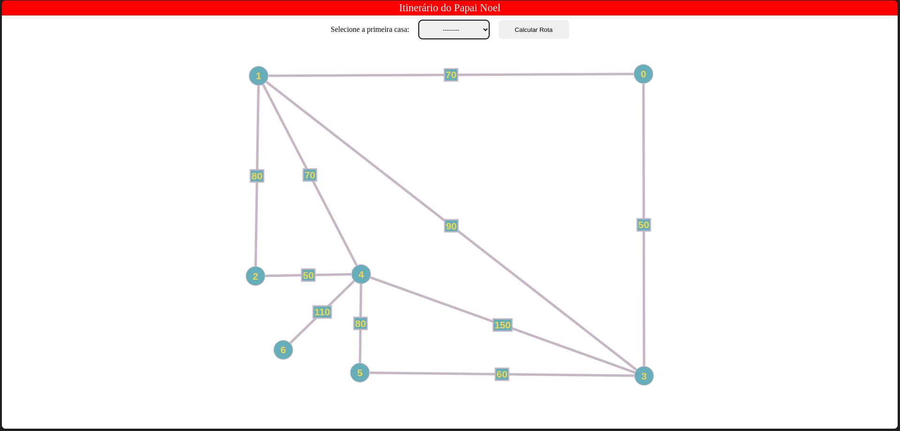

# Tema:

- Grafos 2

# ItinerarioNoel

## Alunos

| Matrícula | Aluno                     |
| ---------- | ------------------------- |
| 200018060  | Gabriel Ferreira da Silva |
| 200044567  | Weslley Alves de Barros   |

Dupla 06

## Sobre

O projeto consiste em utilizar grafos e o algoritmo de Prim para encontrar o menor caminho entre casas. O algoritmo de Prim é uma técnica eficiente que permite determinar o caminho mais curto em um grafo ponderado. Ao aplicar essa abordagem, será possível encontrar a solução de forma precisa e otimizada.

## Screenshots



## Instalação

**Linguagem**: Javascript
**Framework**: AngularJS

## Requisitos

**Node versão**: 16<br>
**NPM**: 8.15
  
## Uso

Passo a passo para rodar o projeto

```bash
npm i
npm run start
```

ou acessar pelo [link](https://projeto-de-algoritmos.github.io/Grafos2-ItinerarioNoel/)

[Video](https://youtu.be/6oYXeu8gWbI) 
